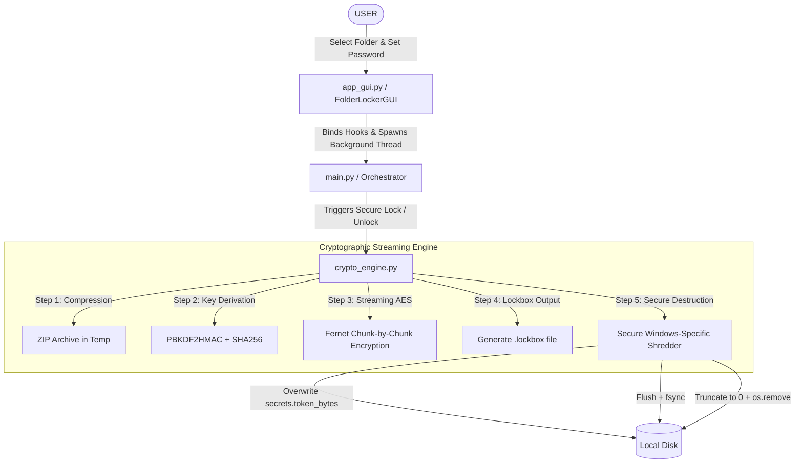

# 🔒 File Locker

A premium, ultra-secure Windows Folder Locker featuring thread-safe streaming cryptography and native in-place secure file shredding.

This desktop application allows you to package any directory folder into a single secure `.lockbox` file using chunk-by-chunk AES encryption. To guarantee absolute privacy, the original folder and its contents are securely shredded (overwritten with random bytes) to prevent recovery by forensic undelete utilities.

---

## ⚙️ How It Works

Below is the execution flow detailing how the native orchestrator binds the custom user interface elements to the secure cryptographic streaming engine:



---

## ✨ Features

* **🎨 Premium Dark-Mode User Interface:** A gorgeous, native Windows dark-themed window leveraging custom-drawn Canvas widgets (`ModernButton` with hover glows and press micro-animations, `ModernEntry` with focus borders, and a thread-safe `ModernProgressBar`).
* **🔑 Highly Defensive Key Derivation:** Leverages PBKDF2HMAC with SHA-256 running 120,000 hashing iterations and a cryptographically secure 16-byte random salt header to block dictionary or brute-force decryption attempts.
* **📦 Chunk-by-Chunk Streaming:** Processes data in 64KB chunks using Fernet (AES-128 in CBC mode with HMAC-SHA256). The resulting `.lockbox` file eliminates memory bloat, allowing you to lock folders of any size.
* **🌪️ Windows-Specific Secure Shredder:** 
  1. Overwrites files in-place with cryptographically secure random bytes (`secrets.token_bytes`).
  2. Flushes the system buffer and calls `os.fsync()` to enforce physical disk writes.
  3. Truncates files to `0` bytes before calling `os.remove()`.
  4. Recursively deletes subdirectories bottom-up to wipe all file traces.
* **🛡️ Path Traversal (Zip Slip) Protection:** Inspects all extracted archive paths using absolute validation to block malicious relative traversal paths (like `../../`) during decryption.
* **🔄 Safe Failure Rollbacks:** On password mismatches or corrupted bytes, the engine raises structured exceptions, immediately deletes half-written directories, and shreds temporary ZIP files to prevent leaving residual data.
* **🚀 Automatic Dependency Resolution:** Automatically checks for the `cryptography` package on startup and silently installs it via pip if missing.

---

## 🚀 Launch Instructions

You can launch and use the application in two ways:

### Method 1: Standalone Executable (Recommended for Non-Programmers)
Double-click **`FileLocker.exe`** directly inside the root folder.
* **Zero Configuration:** This is a fully compiled Windows application. It runs out-of-the-box on any 64-bit Windows 10/11 system without requiring Python or external libraries.
* **Create Desktop Shortcut:** Once open, click the **`CREATE DESKTOP SHORTCUT`** button at the bottom of the window to instantly add a shortcut with a custom **Bank Vault Door** icon directly to your Desktop!

### Method 2: Launch via Python Script
If you have Python installed and wish to run from source, open your terminal in the root folder and run:
```powershell
python main.py
```
*(On first startup, the script will automatically check for and install the `cryptography` package if it is missing).*

---

## 🛠️ Building from Source

If you modify the source files and wish to compile a new `.exe` yourself:

1. Install PyInstaller and dependencies:
   ```powershell
   pip install cryptography pillow pyinstaller
   ```
2. Compile using PyInstaller:
   ```powershell
   python -m PyInstaller --noconsole --onefile --icon=vault.ico --name "FileLocker" main.py
   ```
3. Move the compiled `.exe` from the `dist/` folder back to the root folder, and clean up temporary files:
   ```powershell
   Move-Item dist\FileLocker.exe . -Force ; Remove-Item -Recurse -Force build ; Remove-Item -Recurse -Force dist ; Remove-Item -Force FileLocker.spec
   ```

---

## ⚖️ License & Liability Warning

This project is licensed under the **MIT License**.

> [!CAUTION]
> **CRITICAL SECURITY AND LIABILITY WARNING:**
> This software is provided **"as is"**, without warranty of any kind, express or implied.
> - **Irreversible Shredding:** The secure shredding utility overwrites data in-place and bypasses the Windows Recycle Bin. Deleted files are **permanently destroyed** and cannot be recovered by file recovery software.
> - **Forgotten Passwords:** The cryptographic encryption is highly secure. If you lose or forget the password to a locked folder, **your files will be permanently lost**. The developers assume **no liability or responsibility** for data loss. Please practice locking on a test folder first!
